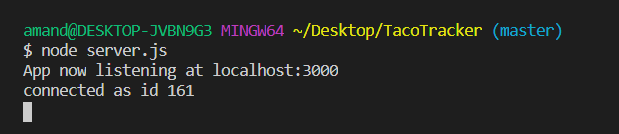
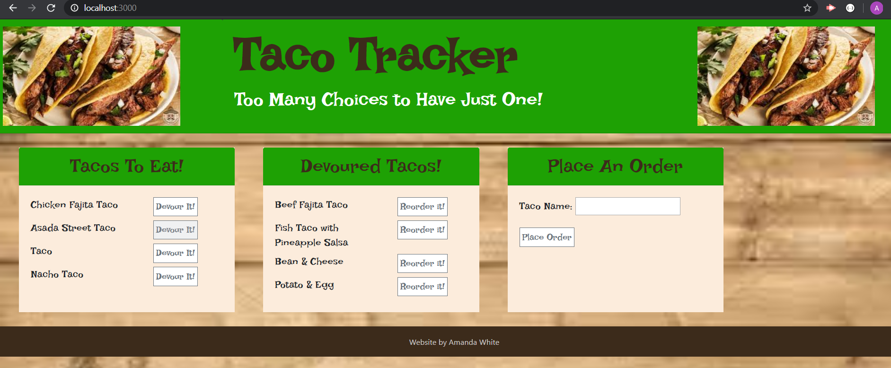
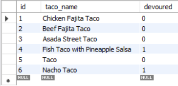
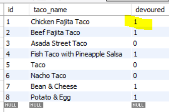
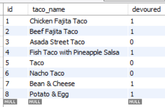
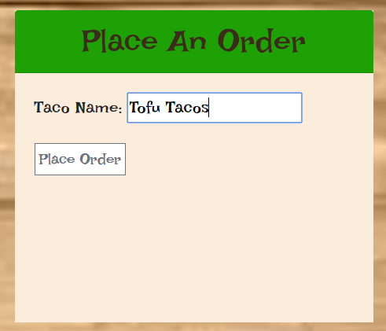
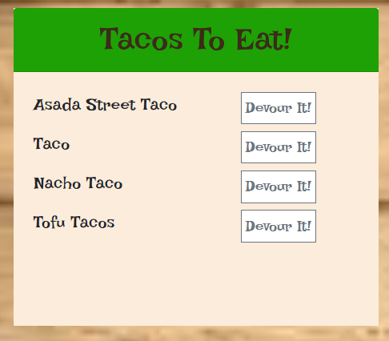

# Node Express Handlebars

This app is all about eating tacos, yes, that's right! You'll create a taco logger with MySQL, Node, Express, Handlebars and a homemade ORM (yum!). Be sure to follow the MVC design pattern; use Node and MySQL to query and route data in your app, and Handlebars to generate your HTML.
* Taco Tracker! is a restaurant app that lets users input the names of tacos they'd like to eat.
```

* Whenever a user submits a taco's name, your app will display the taco on the
 left side of the page -- waiting to be devoured.

* Each taco in the waiting area also has a `Devour it!` button. When the user
 clicks it, the taco will move to the right side of the page.

* Your app will store every taco in a database, whether devoured or not.

```


#### .env file Setup

1. In the command line of the main folder of `Taco Tracker` type `touch .env` 

1. In your text editor, open the `.env` file and type `MYSQL_PASSWORD = "enter your MySQL password here"`

1. Save the file


#### Open App in Browser

1. In the command line go into main folder of `Taco Tracker`

1. Type `node server.js` end hit enter



1. Go to your browser and open a new tab and type `localhost:3000` then hit enter


As you can see from the image there are 3 columns: Ready to Eat the Taco, Devoured Tacoss, Order Tacos 


#### Using the App

**Taco Tracker Option**

* In the `Tacos to Eat` column, if you hit the `Devour It !` button it will change the devour status to true in MySQL, which will place the taco in the Devoured Tacoss column. This taco will still be listed in MySQL. For example, if you choose to devour the Chicken Fajita Taco, this is what it looks like in MySQL. Note that the Devour number is a 0 which equals true:

	

* If then I hit the button to devour it, you can see that the Devour number changes to false, which in binary code is 1:

	

**Reorder Taco**

* You can choose to reorder a taco that was eaten if it sounds good to you. Just hit the `Reoder It` button under Devoured Tacos and it will show as Ready to Eat again.

**Order Tacos**

* You can add or order a taco by going to that column and typing in the name of your favorite buger then hit order. The taco will be added to the Eat the Taco column since the default setting on adding a taco is to set the Devour to true, which places it in that column.

* Here is MySQL before I added the taco:

	
	

* Here I am adding Tofu Tacos:

	


* This shows the addition to the Ready to Eat Tacos column:

	


## Deployment

This application is delployed at https://mandystacotracker.herokuapp.com/ | https://git.heroku.com/mandystacotracker.git


## Author

* [Amanda White](https://github.com/AmandaWhiteTX)


